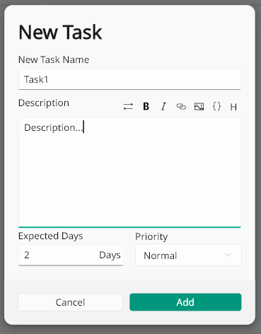

# JTasks

<a title="Made with Fluent Design" href="https://github.com/bdlukaa/fluent_ui">
  
</a>
  
**JTasks** is a modern light-weight cross-platform task-boards management software made with flutter and fluent-ui. It can assist you manage tasks and progress of your job or project especially for solo devs.
> **Warning** The project is still under development!!

## Features

- Use board to manage your tasks
  

  
- Easily create task with embedded markdown editor
  

  
- Dark mode supported
  


## Getting Started
1. clone the project
```git clone https://github.com/JenkinsGage/JTasks.git```
2. cd into the project
```cd JTasks```
3. get all the dependencies
```flutter pub get```
4. build the database
```flutter pub run build_runner build```

## Flutter

This project is a Flutter application.

A few resources to get you started if this is your first Flutter project:

- [Lab: Write your first Flutter app](https://docs.flutter.dev/get-started/codelab)
- [Cookbook: Useful Flutter samples](https://docs.flutter.dev/cookbook)

For help getting started with Flutter development, view the
[online documentation](https://docs.flutter.dev/), which offers tutorials, samples, guidance on
mobile development, and a full API reference.
